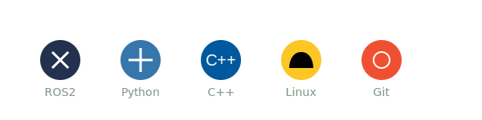

  

### 👋 Hi there, I'm Pravin Raj!

I'm a passionate **Software Engineer** with a deep interest in **Robotics** and **ROS2**. I love building intelligent systems and exploring the intersection of AI and hardware.

---

### 🛠️ Skills & Technologies

  

- **Languages:** Python, C++, C, SQL
- **Frameworks/Tools:** ROS2, Gazebo, Git, Linux, Docker
- **Interests:** Robotics, AI/ML, Embedded Systems

---

### 📊 GitHub Analytics

  
  

  

---

### 🤝 Let's Connect!

- 🌍 [LinkedIn](https://www.linkedin.com/in/pravin-raj-03/) (Add your link if different)
- 🐦 [Twitter](https://twitter.com/PravinRaj03) (Add your link if different)
- 📧 [Email](mailto:pravinraj2054@gmail.com)

  

